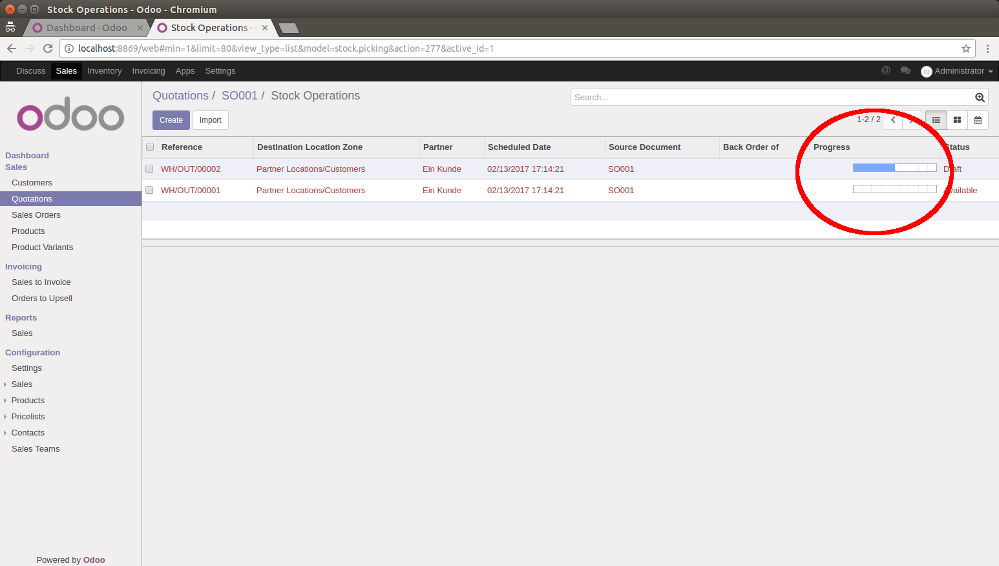
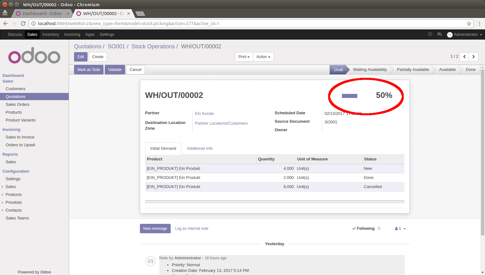

.. image:: https://img.shields.io/badge/licence-AGPL--3-blue.svg
   :target: http://www.gnu.org/licenses/agpl-3.0-standalone.html
   :alt: License: AGPL-3

================
Picking Progress
================

This module adds a display of the progress of pickings.

The progress of a picking is the percentage of its non-cancelled lines (i.e.,
stock moves) that are 'done'.  It will be displayed as a progress bar in both
the picking tree view and form view.

Usage
=====

Installing this module modifies the *stock.picking* tree view by adding a
'Progress' column

and the *stock.picking* form view by adding the 'Progress' field to the right
of the name field

Bug Tracker
===========

Bugs are tracked on `GitHub Issues <https://github.com/OCA/stock-logistics-workflow/issues>`_.
In case of trouble, please check there if your issue has already been reported.
If you spotted it first, help us smashing it by providing a detailed and welcomed feedback
`here <https://github.com/OCA/stock-logistics-workflow/issues/new?body=module:%20picking_progress%0Aversion:%2010.0%0A%0A**Steps%20to%20reproduce**%0A-%20...%0A%0A**Current%20behavior**%0A%0A**Expected%20behavior**>`_.

Credits
=======

Contributors
------------

* Andreas Zöllner (initOS) <andreas.zoellner@initos.com>

Maintainer
----------

.. image:: https://odoo-community.org/logo.png
   :alt: Odoo Community Association
   :target: https://odoo-community.org

This module is maintained by the OCA.

OCA, or the Odoo Community Association, is a nonprofit organization whose
mission is to support the collaborative development of Odoo features and
promote its widespread use.

To contribute to this module, please visit https://odoo-community.org.
